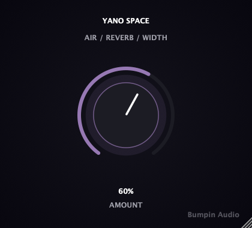

# Yano Space

**A one-knob space processor for amapiano production.**

Drop in a log drum, Rhodes stab, or full mix, turn the single `Amount`
knob, and get an airier, more spacious sound tuned for amapiano's open
character — a high-shelf lift for sparkle, a spacious stereo reverb, and
a gentle mid/side widening on top, bass kept mono so nothing gets smeared.
Built with [JUCE](https://juce.com/), ships as VST3 / AU / Standalone on
macOS and Windows.

<p align="center">
  
</p>

<p align="center">
  <strong><a href="https://github.com/nabsei/yano-space/releases/latest">⬇ Download the latest beta</a></strong> — macOS and Windows, free during the beta period.
  · <a href="CHANGELOG.md">Changelog</a>
</p>

## Why one knob

Same philosophy as Yano Log, Yano Finish, and the Montagem chain (same
publisher, different genre focus): one macro parameter, no configuration.
`Amount` drives a high-shelf air EQ, a spacious stereo reverb, and a
mid/side width expander together, all researched against amapiano
mixing/mastering references rather than guessed -- see the comments in
`Source/YanoSpaceProcessor.cpp` for the reasoning behind each stage.

Deliberately not a Montagem Widener reskin: amapiano references lean
toward an airier, more reverberant sense of space (open Rhodes stabs, log
drum sitting in room) rather than phonk's pure, aggressive M/S width, so
this chain leads with reverb and keeps the widening gentle.

## Status

Early-stage / actively developed public beta.

This repository shows the plugin's **architecture**: JUCE plugin wrapper,
custom UI, parameter handling, state save/load. The exact calibration used
in the shipped/tested build (air shelf gain, reverb size/damping, width
gain) is simplified in `Source/YanoSpaceProcessor.cpp` here -- that
tuning is the actual product, not open source at this stage.

## Features

- Single macro parameter (`Amount`) driving air EQ, reverb, and stereo
  width together
- High-shelf "air" EQ above 9kHz for openness and sparkle
- Spacious stereo reverb, airier and more prominent than Yano Finish's
  short glue-reverb
- Gentle mid/side stereo widening with a Haas-delay assist, gentler max
  width than Montagem Widener
- Bass kept mono below a 150Hz crossover, so widening never smears the
  low end
- Denormal-safe processing and parameter smoothing (no zipper noise)
- Builds as **VST3**, **AU** (passes `auval` validation), and a
  **Standalone** app

## Tech stack

- C++17, [JUCE](https://github.com/juce-framework/JUCE) (audio processing + UI)
- CMake + Ninja

## Building

```bash
git clone --depth 1 https://github.com/juce-framework/JUCE.git libs/JUCE
cmake -B build -G Ninja -DCMAKE_BUILD_TYPE=Release
cmake --build build
```

On macOS, add `-DCMAKE_OSX_ARCHITECTURES="arm64;x86_64"` to the configure step
to build a universal binary (Apple Silicon + Intel) instead of the host-only
default. The official beta releases are built this way.

This produces a VST3, an AU component, and a standalone app under
`build/YanoSpace_artefacts/Release/`, and installs the plugin formats into
your system's plugin folders automatically (`COPY_PLUGIN_AFTER_BUILD`).

## Project structure

```
Source/
  PluginEntry.cpp            JUCE plugin entry point
  YanoSpaceProcessor.*        AudioProcessor: air EQ/reverb/width chain
  PluginEditor.*               Custom UI (rotary knob, layout)
  YanoSpaceLookAndFeel.h       Custom LookAndFeel for the rotary control
CMakeLists.txt
```

## Open items

- [ ] Code signing / notarization for both macOS and Windows (current
      beta requires a one-time manual step on first install)
- [ ] Automated test suite (headless DSP + UI snapshot tools, private repo)
- [ ] Real-world testing in a DAW and on an actual Windows machine --
      so far only Standalone-on-macOS and CI compile checks

## License

**This repository's source code:** MIT — see [LICENSE](LICENSE). Covers
the architecture shown here (JUCE plugin wrapper, UI, build setup). As
noted above, the DSP calibration used in the actual product is not
included in this source.

**The compiled plugin (downloads / releases):** free to use during the
beta period, not free to redistribute or resell. See the `TERMS.txt`
included in each release download for the full terms. A paid license will
replace this beta terms after the beta period ends.

## Also from Bumpin Audio

- [Yano Log](https://github.com/nabsei/yano-log) — one-knob amapiano log drum synth
- [Yano Finish](https://github.com/nabsei/yano-finish) — one-knob amapiano finisher (this is the third piece of the Yano line)
- [Yano Swing](https://github.com/nabsei/yano-swing) — one-knob MIDI groove processor (the fourth piece of the Yano line)
- [Montagem 808](https://github.com/nabsei/montagem-808)
- [Montagem Finisher](https://github.com/nabsei/montagem-finisher)
- [Montagem Widener](https://github.com/nabsei/montagem-widener)
- [Montagem Punch](https://github.com/nabsei/montagem-punch)
- [Delta Zero](https://github.com/nabsei/delta-zero) — phase-cancellation null-test / difference-checker for audio engineers
- [Delta Blind](https://github.com/nabsei/delta-blind) — loudness-matched A/B compare tool for audio engineers
